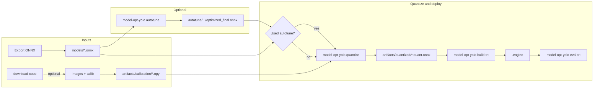

# Model-Optimizer-YOLO

[](LICENSE)
[](https://www.python.org/)
[](https://catalog.ngc.nvidia.com/orgs/nvidia/containers/tensorrt)
[](https://github.com/NVIDIA/Model-Optimizer)
[](https://onnxruntime.ai/)
[](pyproject.toml)

**ONNX post-training quantization (PTQ)** and **TensorRT** deployment helpers for **YOLO-style** detectors — built on [NVIDIA Model Optimizer](https://github.com/NVIDIA/Model-Optimizer), with COCO calibration and optional Q/DQ **autotune**.

| | |
|--|--|
| **CLI** | `model-opt-yolo` |
| **Docs** | [`docs/index.md`](docs/index.md) |

---

## Scope: Ultralytics exports and `eval-trt`

**Primary workflow:** this repo is built around **ONNX weights exported from Ultralytics** using **[levipereira/ultralytics](https://github.com/levipereira/ultralytics)** — a fork aimed at deployment-oriented export (ONNX / TensorRT–friendly graphs, `onnx_trt`, etc.).

**On the roadmap:** support for additional export paths, including pipelines aligned with **[DeepStream-Yolo](https://github.com/marcoslucianops/DeepStream-Yolo)** and ONNX export from the **official [ultralytics/ultralytics](https://github.com/ultralytics/ultralytics)** repository.

**`eval-trt` — expected TensorRT I/O** (see [`docs/cli-reference.md`](docs/cli-reference.md)):

| Role | Tensor | Shape |
|------|--------|--------|
| Input | `images` | `[B, 3, H, W]` |
| Output | `num_dets` | `[B, 1]` |
| Output | `det_boxes` | `[B, K, 4]` — `x1, y1, x2, y2` in input space; `K` = max detections |
| Output | `det_scores` | `[B, K]` |
| Output | `det_classes` | `[B, K]` — class indices |

**Dynamic batch:** the batch dimension **`B`** may be dynamic in the TensorRT engine (optimization profile). The bundled COCO **`eval-trt`** tool runs **one image per inference** (`B = 1`).

Exports from **[levipereira/ultralytics](https://github.com/levipereira/ultralytics)** follow this layout. **Raw pre‑NMS** outputs (other tensor names or shapes) are **not** supported yet.

---

## Pipeline

**Optional** COCO data and Q/DQ autotune, then **calib → quantize → TensorRT engine → eval**.



*More detail: [docs/workflow.md](docs/workflow.md)*

---

## Stack

| Layer | Choice |
|------|--------|
| **Quantization** | `nvidia-modelopt[onnx]` (GitHub `main` in the image) |
| **Calibration** | ONNX Runtime **GPU** (CUDA **13** nightly, aligned with the image) |
| **Engine** | **TensorRT** **26.02** (NGC `tensorrt:26.02-py3`) |
| **License** | **Apache 2.0** — [LICENSE](LICENSE), [NOTICE](NOTICE) |

---

## Prerequisites (Docker workflow)

You need a **machine with an NVIDIA GPU** and software on the host so containers can use CUDA / TensorRT:

| Requirement | Notes |
|-------------|--------|
| **NVIDIA GPU** | A CUDA-capable graphics card (e.g. GeForce / RTX / datacenter GPU). |
| **NVIDIA driver** | Installed on the host; `nvidia-smi` should work **before** you use Docker. |
| **Docker** | [Docker Engine](https://docs.docker.com/engine/install/) installed and running. |
| **NVIDIA Container Toolkit** | Lets `docker run --gpus all` pass the GPU into the container. [Install guide](https://docs.nvidia.com/datacenter/cloud-native/container-toolkit/install-guide.html). |

Verify the driver with `nvidia-smi` on the host. After installing the toolkit, follow NVIDIA’s guide to confirm GPU access from Docker (e.g. run `nvidia-smi` inside a test container).

---

## Run with Docker (default)

The **`model-opt-yolo`** package is **installed inside the image** at build time. You do **not** need to mount the Git repository to run — only bind-mount three folders on the host so ONNX, datasets, and outputs persist when the container stops.

### 1. Build the image (needs the Dockerfile)

Clone once (or copy the `docker/` context elsewhere) and build:

```bash
git clone https://github.com/levipereira/Model-Optimizer-YOLO.git
cd Model-Optimizer-YOLO
docker build -f docker/Dockerfile -t modelopt-yolo-ptq .
```

### 2. Run with `models/`, `data/`, and `artifacts/` on the host

Pick a root directory on the host (any path you like) and create the three subfolders:

```bash
export DATA_ROOT="$HOME/model-opt-yolo"
mkdir -p "$DATA_ROOT/models" "$DATA_ROOT/data" "$DATA_ROOT/artifacts"

docker run --gpus all --rm -it \
  -w /workspace/model-opt-yolo \
  -v "$DATA_ROOT/models:/workspace/model-opt-yolo/models" \
  -v "$DATA_ROOT/data:/workspace/model-opt-yolo/data" \
  -v "$DATA_ROOT/artifacts:/workspace/model-opt-yolo/artifacts" \
  modelopt-yolo-ptq
```

Inside the container, the working directory is **`/workspace/model-opt-yolo`**. Use the same **relative** paths as in the docs: `models/...`, `data/coco/...`, `artifacts/...` — they map to `$DATA_ROOT` on the host.

### Host ↔ container mapping

| Host | Container |
|------|-----------|
| `$DATA_ROOT/models` | `/workspace/model-opt-yolo/models` |
| `$DATA_ROOT/data` | `/workspace/model-opt-yolo/data` |
| `$DATA_ROOT/artifacts` | `/workspace/model-opt-yolo/artifacts` |

Change `DATA_ROOT` to another disk or folder if you want.

See [docs/docker-reference.md](docs/docker-reference.md) for build args and persistence details.

### Development (edit mode in Docker)

To **develop** using the image: build it, then **bind-mount your Git clone** into `/workspace/model-opt-yolo` so you edit the repo on the host and run inside the container. Step-by-step: **[Edit mode with Docker (developers)](docs/installation.md#edit-mode-with-docker-developers)** in [Installation](docs/installation.md).

---

## Edit code locally (optional)

If you want to change this project and run **outside** Docker, clone the repo, then install in editable mode from the repository root:

```bash
git clone https://github.com/levipereira/Model-Optimizer-YOLO.git
cd Model-Optimizer-YOLO
pip install -e .
model-opt-yolo --help
```

You still need a matching CUDA / TensorRT / ONNX Runtime stack on the host; the Docker image is the supported baseline.

---

## Quick steps

Run these **inside the container** (or locally after `pip install -e .`):

1. Put ONNX under `models/`.
2. *(Optional)* `model-opt-yolo download-coco --output-dir data/coco`
3. `model-opt-yolo calib --images_dir data/coco/val2017 --calibration_data_size 500 --img_size 640`
4. `model-opt-yolo quantize --calibration_data artifacts/calibration/…npy --onnx_path models/your.onnx`
5. `model-opt-yolo build-trt --onnx artifacts/quantized/your…quant.onnx --img-size 640`
6. `model-opt-yolo eval-trt --engine …engine --images data/coco/val2017 --annotations data/coco/annotations/instances_val2017.json`

CLI details: [docs/cli-reference.md](docs/cli-reference.md) · optional docs site: `pip install -e ".[docs]" && mkdocs serve` ([`mkdocs.yml`](mkdocs.yml))

---

## License

Copyright © 2026 [Levi Pereira](mailto:levi.pereira@gmail.com). Licensed under the **Apache License, Version 2.0**. See [LICENSE](LICENSE) and [NOTICE](NOTICE) for terms and third-party notices.
