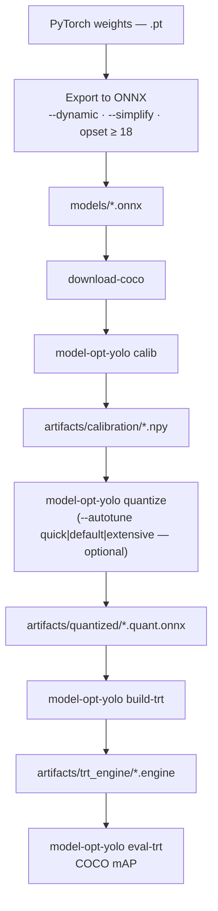

# Model-Optimizer-YOLO

[](LICENSE)
[](https://www.python.org/)
[](https://catalog.ngc.nvidia.com/orgs/nvidia/containers/tensorrt)
[](https://github.com/NVIDIA/Model-Optimizer)
[](https://onnxruntime.ai/)
[](pyproject.toml)
[](https://context7.com/levipereira/model-optimizer-yolo)
[-in%20progress-F59E0B)](https://github.com/levipereira/Model-Optimizer-YOLO/discussions)

**ONNX PTQ** and **TensorRT** helpers for **YOLO-style** detectors — [NVIDIA Model Optimizer](https://github.com/NVIDIA/Model-Optimizer), COCO calibration, optional **`quantize --autotune`** ([workflow](docs/workflow.md)).

| | |
|--|--|
| **CLI** | `model-opt-yolo` |
| **Docs** | [`docs/README.md`](docs/README.md) |

---

## Table of Contents

- [Community](#community)
- [Pipeline](#pipeline)
- [Quick Steps](#quick-steps)
- [Supported Output Formats](#supported-output-formats)
- [Technology Stack](#technology-stack)
- [Getting Started](#getting-started)
  - [Prerequisites](#prerequisites)
  - [Run with Docker (default)](#run-with-docker-default)
  - [Local Installation (optional)](#local-installation-optional)
- [License](#license)

---

## Community

**Do not open [Issues](https://github.com/levipereira/Model-Optimizer-YOLO/issues) for questions or for posting results and findings** (benchmarks, mAP, parameter setups, “what worked for my model,” and similar). Use **[GitHub Discussions](https://github.com/levipereira/Model-Optimizer-YOLO/discussions)** for that.

Please read the pinned **[welcome announcement](https://github.com/levipereira/Model-Optimizer-YOLO/discussions/1)** — it describes how we use Discussions (questions, results, recipes per model, ideas for the project) and that **[Issues](https://github.com/levipereira/Model-Optimizer-YOLO/issues) are reserved for confirmed bugs** with clear, reproducible steps (versions, commands, minimal inputs).

**Status (maintainer):** Published **reference results** are **not** posted yet — that work is **still in progress**. Those will include **COCO mAP** (accuracy) and **latency** (timing / throughput), plus **recommended PTQ settings** — quantization **precision** (e.g. int8, int4, fp8) and **calibration / quantizer methods** (e.g. entropy), as used in **`quantize`**. The Discussions category for results and recipes is open for the community; official tables and maintainer write-ups will be added when ready.

---

## Pipeline

**Fastest path:** **`model-opt-yolo pipeline-e2e --onnx models/…onnx`** — runs calib through bench and writes a **Markdown report** (session logs under `artifacts/pipeline_e2e/sessions/…`). See [workflow](docs/workflow.md).

Manual PTQ path: **calib** → **quantize** → **build-trt** → **eval-trt** (optional **`--autotune`** on `quantize`). For a **report** from existing logs, use **`report-runs`**. You need images + annotations and **`calib.npy`** from **`calib`**.



*Details, `pipeline-e2e`, and report: [docs/workflow.md](docs/workflow.md)*

---

## Quick Steps

Run **inside the container** (or locally after `pip install -e .`):

- **One command (calib → engine → eval → bench + report):**  
  `model-opt-yolo pipeline-e2e --onnx models/your.onnx` — add `--img-size`, `--input-name`, `--output-format` as needed ([workflow](docs/workflow.md)).

**Or step by step:**

1. ONNX under `models/` (match your production export).
2. `model-opt-yolo download-coco --output-dir data/coco`
3. `model-opt-yolo calib --images_dir data/coco/val2017 --calibration_data_size 500 --img_size 640`
4. `model-opt-yolo quantize --calibration_data artifacts/calibration/…npy --onnx_path models/your.onnx` (optional: `--autotune default`)
5. `model-opt-yolo build-trt --onnx artifacts/quantized/your…quant.onnx --img-size 640` → `artifacts/trt_engine/<stem>.engine` (default `--mode strongly-typed`; see [docs](docs/cli-reference.md#model-opt-yolo-build-trt))
6. `model-opt-yolo eval-trt --output-format onnx_trt --engine … --images data/coco/val2017 --annotations data/coco/annotations/instances_val2017.json` (pick `ultralytics` / `deepstream_yolo` if needed — table below)

CLI details: [docs/cli-reference.md](docs/cli-reference.md) · optional docs site: `pip install -e ".[docs]" && mkdocs serve` ([`mkdocs.yml`](mkdocs.yml))

---

## Supported Output Formats

The **PyTorch → ONNX** step defines tensor names, ranks, and post-processing semantics. **`--output-format`** in `eval-trt` must match that export (and the TensorRT build derived from it); the `.engine` layout alone is not enough if the underlying ONNX was produced differently. Flows discussed here assume ONNX exported with **`--dynamic`**, **`--simplify`**, and **`--opset` 18 or newer** (or equivalent flags in your exporter) so shapes and graphs stay consistent through PTQ and `trtexec`.

`model-opt-yolo eval-trt` scores a **TensorRT `.engine`** on COCO by decoding **how detections leave the network** for your stack. Pass **`--output-format`** accordingly. Full flags and shapes: [`docs/cli-reference.md`](docs/cli-reference.md).

| `--output-format` | Typical source | Role |
|-------------------|----------------|------|
| **`onnx_trt`** | **[levipereira/ultralytics](https://github.com/levipereira/ultralytics)** — `format=onnx_trt` / `onnx_trt.py` (four fixed ONNX outputs; see that repo's detection table). This path is **not** the same as naming the graph "EfficientNMS": some heads are end-to-end in-network, others use EfficientNMS_TRT in the exporter — TensorRT still exposes `num_dets`, `det_boxes`, `det_scores`, `det_classes`. | Read the four tensors, take the first `num_dets` rows, filter by confidence, **undo letterbox**, COCO category mapping, **pycocotools** mAP. **`efficient_nms`** is accepted as an alias (legacy name). |
| **`ultralytics`** | **[ultralytics/ultralytics](https://github.com/ultralytics/ultralytics)** TensorRT export with integrated NMS: a **single** output tensor (e.g. `output0`) shaped `[B, N, 6]` (e.g. `N = 300`). | Each row is **`x1, y1, x2, y2, score, class`** in **letterboxed input space** (NMS already applied in the graph). Filter by `--conf-thres`, letterbox inverse, COCO mapping, mAP. |
| **`deepstream_yolo`** | **[marcoslucianops/DeepStream-Yolo](https://github.com/marcoslucianops/DeepStream-Yolo)** — engines aligned with the **DeepStream custom bbox parser** (`nvdsparsebbox_Yolo`): one output (often named `output`) `[B, num_anchors, 6]` (e.g. **8400** proposals at 640×640). | Same six fields as the parser (**xyxy + score + class**). In DeepStream, clustering/NMS runs in the pipeline; in **`eval-trt`** we apply **per-class NMS** in Python (`--iou-thres`), then letterbox inverse and mAP. |

**Input tensor:** engines may use `images`, `input`, or another name; `eval-trt` binds the **first** input — ensure your build profile matches **NCHW** and the same letterbox normalization as calibration (**÷255**, RGB).

**Batch:** **`B`** may be dynamic in the engine; evaluation uses **`B = 1`** per image.

---

## Technology Stack

| Layer | Choice |
|------|--------|
| **Quantization** | `nvidia-modelopt[onnx]` (GitHub `main` in the image) |
| **Calibration** | ONNX Runtime **GPU** (CUDA **13** nightly, aligned with the image) |
| **Engine** | **TensorRT** **26.02** (NGC `tensorrt:26.02-py3`) |
| **License** | **Apache 2.0** — [LICENSE](LICENSE), [NOTICE](NOTICE) |

---

## Getting Started

### Prerequisites

You need a **machine with an NVIDIA GPU** and software on the host so containers can use CUDA / TensorRT:

| Requirement | Notes |
|-------------|--------|
| **NVIDIA GPU** | A CUDA-capable graphics card (e.g. GeForce / RTX / datacenter GPU). |
| **NVIDIA driver** | Installed on the host; `nvidia-smi` should work **before** you use Docker. |
| **Docker** | [Docker Engine](https://docs.docker.com/engine/install/) installed and running. |
| **NVIDIA Container Toolkit** | Lets `docker run --gpus all` pass the GPU into the container. [Install guide](https://docs.nvidia.com/datacenter/cloud-native/container-toolkit/install-guide.html). |

Verify the driver with `nvidia-smi` on the host. After installing the toolkit, follow NVIDIA's guide to confirm GPU access from Docker (e.g. run `nvidia-smi` inside a test container).

### Run with Docker (default)

The **`model-opt-yolo`** package is **installed inside the image** at build time. You do **not** need to mount the Git repository to run — only bind-mount three folders on the host so ONNX, datasets, and outputs persist when the container stops.

#### 1. Build the image (needs the Dockerfile)

Clone once (or copy the `docker/` context elsewhere) and build:

```bash
git clone https://github.com/levipereira/Model-Optimizer-YOLO.git
cd Model-Optimizer-YOLO
docker build -f docker/Dockerfile -t modelopt-yolo-ptq .
```

#### 2. Run with `models/`, `data/`, and `artifacts/` on the host

Pick a root directory on the host (any path you like) and create the three subfolders:

```bash
export DATA_ROOT="$HOME/model-opt-yolo"
mkdir -p "$DATA_ROOT/models" "$DATA_ROOT/data" "$DATA_ROOT/artifacts"

docker run --gpus all --rm -it \
  -w /workspace/model-opt-yolo \
  -v "$DATA_ROOT/models:/workspace/model-opt-yolo/models" \
  -v "$DATA_ROOT/data:/workspace/model-opt-yolo/data" \
  -v "$DATA_ROOT/artifacts:/workspace/model-opt-yolo/artifacts" \
  modelopt-yolo-ptq
```

Inside the container, the working directory is **`/workspace/model-opt-yolo`**. Use the same **relative** paths as in the docs: `models/...`, `data/coco/...`, `artifacts/...` — they map to `$DATA_ROOT` on the host.

#### Host ↔ container mapping

| Host | Container |
|------|-----------|
| `$DATA_ROOT/models` | `/workspace/model-opt-yolo/models` |
| `$DATA_ROOT/data` | `/workspace/model-opt-yolo/data` |
| `$DATA_ROOT/artifacts` | `/workspace/model-opt-yolo/artifacts` |

Change `DATA_ROOT` to another disk or folder if you want.

See [docs/docker-reference.md](docs/docker-reference.md) for build args and persistence details.

#### Development (edit mode in Docker)

To **develop** using the image: build it, then **bind-mount your Git clone** into `/workspace/model-opt-yolo` so you edit the repo on the host and run inside the container. Step-by-step: **[Edit mode with Docker (developers)](docs/installation.md#edit-mode-with-docker-developers)** in [Installation](docs/installation.md).

### Local Installation (optional)

If you want to change this project and run **outside** Docker, clone the repo, then install in editable mode from the repository root:

```bash
git clone https://github.com/levipereira/Model-Optimizer-YOLO.git
cd Model-Optimizer-YOLO
pip install -e .
model-opt-yolo --help
```

You still need a matching CUDA / TensorRT / ONNX Runtime stack on the host; the Docker image is the supported baseline.

---

## License

Copyright © 2026 [Levi Pereira](mailto:levi.pereira@gmail.com). Licensed under the **Apache License, Version 2.0**. See [LICENSE](LICENSE) and [NOTICE](NOTICE) for terms and third-party notices.
