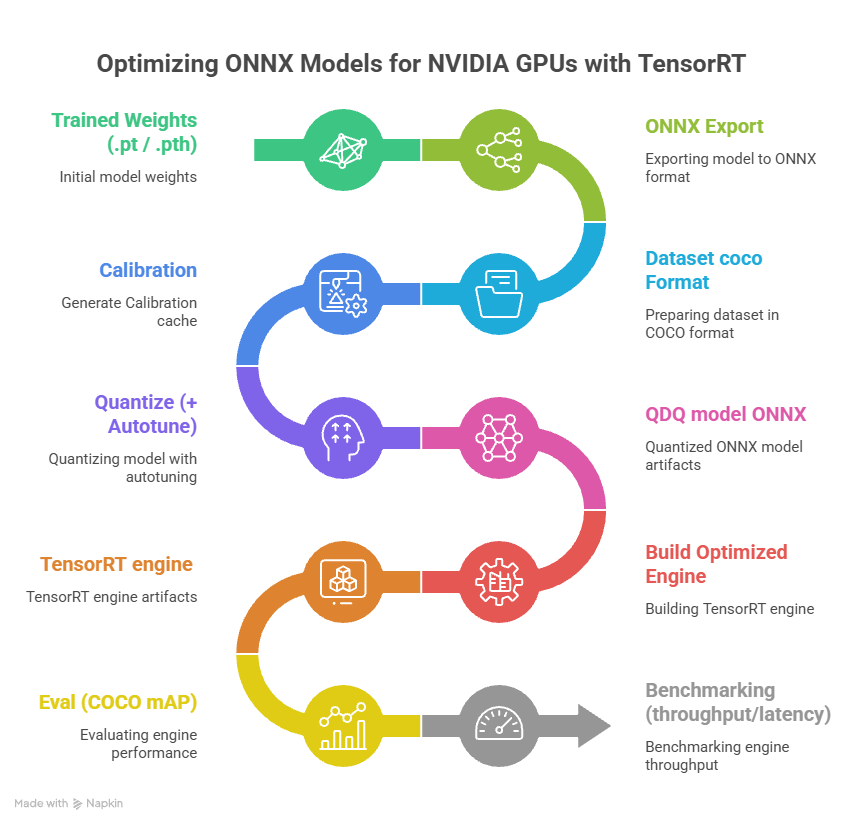
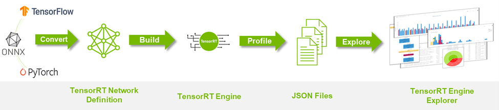

# Model-Optimizer-ONNX

[](LICENSE)
[](https://www.python.org/)
[](https://catalog.ngc.nvidia.com/orgs/nvidia/containers/tensorrt)
[](https://github.com/NVIDIA/Model-Optimizer)
[](https://onnxruntime.ai/)
[](pyproject.toml)
[](https://context7.com/levipereira/model-optimizer-onnx)
[-in%20progress-F59E0B)](https://github.com/levipereira/Model-Optimizer-ONNX/discussions)

**modelopt-onnx-ptq** is a CLI for **ONNX post-training quantization (PTQ)** and **TensorRT** on **exported** object-detection ONNX models: [NVIDIA Model Optimizer](https://github.com/NVIDIA/Model-Optimizer), COCO calibration, **`quantize`** (optional **`--autotune`**), **`build-trt`**, **`eval-trt`**, **`pipeline-e2e`**, and reports. Training and export to ONNX stay **outside** this repo — you start from **`models/*.onnx`**.

| | |
|--|--|
| **CLI** | `modelopt-onnx-ptq` |
| **Docs** | [`docs/README.md`](docs/README.md) |
| **AI coding agents** | [`skills/README.md`](skills/README.md) |

---

## Table of Contents

- [Pipeline](#pipeline)
- [TREx workflow (diagram)](#trex-workflow-diagram)
- [Quick Steps](#quick-steps)
- [Supported Output Formats](#supported-output-formats)
- [Technology Stack](#technology-stack)
- [AI coding agents](#ai-coding-agents)
- [Getting Started](#getting-started)
  - [Prerequisites](#prerequisites)
  - [Run with Docker (default)](#run-with-docker-default)
  - [Local Installation (optional)](#local-installation-optional)
- [Community](#community)
- [License](#license)

---

## Pipeline



Export and training are **not** in this project — bring **`models/*.onnx`** from your stack (Ultralytics, DeepStream-Yolo, etc.). Then: **`download-coco`** → **`calib`** → **`quantize`** (optional **`--autotune`**) → **`build-trt`** → **`eval-trt`** / **`trt-bench`**; or run everything with **`pipeline-e2e --onnx models/…onnx`** (FP16 baseline + PTQ matrix + **`report-runs`** under `artifacts/pipeline_e2e/sessions/…`). Details: [docs/workflow.md](docs/workflow.md).

---

## TREx workflow diagram

Optional **TensorRT Engine Explorer** profiling (`env_trex`, **`trex-analyze`**, **`process_engine.py`**, notebooks) — **not** required for PTQ.



Diagram sources: [`docs/images/`](docs/images/README.md).

---

## Quick Steps

Run **inside the container** (or locally after `pip install -e .`):

- **One command (calib → FP16 baseline → PTQ combos → report):**  
  `modelopt-onnx-ptq pipeline-e2e --onnx models/your.onnx` — add `--img-size`, `--input-name`, `--output-format` as needed (**`--output-format auto`** passes **`--onnx`** to **eval-trt** for layout inference); use **`--no-fp16-baseline`** only if you do not want the FP16 comparison row ([workflow](docs/workflow.md)).

**Or step by step:**

1. **ONNX under `models/`** — already exported from your stack (see scope above); match letterbox, input name, and outputs to what you will use in production.
2. `modelopt-onnx-ptq download-coco --output-dir data/coco`
3. `modelopt-onnx-ptq calib --images_dir data/coco/val2017 --calibration_data_size 500 --img_size 640`
4. `modelopt-onnx-ptq quantize --calibration_data artifacts/calibration/…npy --onnx_path models/your.onnx` (optional: `--autotune default`)
5. **Optional FP16 reference:** `modelopt-onnx-ptq build-trt --onnx models/your.onnx --mode fp16` (default output `artifacts/trt_engine/<stem>.fp16.b<batch>_i.engine`) then **`eval-trt`** / **`trt-bench`** on that engine (use **`SESSION_ID`** or **`--session-id`** on each command for a unified report).
6. `modelopt-onnx-ptq build-trt --onnx artifacts/quantized/your…quant.onnx --img-size 640 --batch 1` → `artifacts/trt_engine/<stem>.b<batch>_i.engine` (default `--mode strongly-typed`; see [docs](docs/cli-reference.md#modelopt-onnx-ptq-build-trt))
7. `modelopt-onnx-ptq eval-trt --output-format auto --onnx models/your.onnx --engine …` or set **`ultralytics`** / **`deepstream_yolo`** explicitly — table below
8. `modelopt-onnx-ptq trt-bench --engine …` for throughput logs used by **`report-runs`**
9. `modelopt-onnx-ptq report-runs` (with **`SESSION_ID`** set) **or** `--session-id` / `--trt-logs-dir` / `--eval-logs-dir` as needed

CLI details: [docs/cli-reference.md](docs/cli-reference.md) · optional docs site: `pip install -e ".[docs]" && mkdocs serve` ([`mkdocs.yml`](mkdocs.yml))

---

## Supported Output Formats

The **PyTorch → ONNX** step defines tensor names, ranks, and post-processing semantics. **`eval-trt`** only supports a **single** detection tensor **`[B, N, 6]`** (see below). Use **`auto`** with **`--onnx`** to pick **`ultralytics`** vs **`deepstream_yolo`**. **Four-tensor** exports (`num_dets`, `det_*`) are **not** supported. Flows discussed here assume ONNX exported with **`--dynamic`**, **`--simplify`**, and **`--opset` 18 or newer** (or equivalent flags in your exporter) so shapes and graphs stay consistent through PTQ and `trtexec`.

`modelopt-onnx-ptq eval-trt` scores a **TensorRT `.engine`** on COCO by decoding **how detections leave the network** for your stack. Pass **`--output-format`** (or **`auto`** + **`--onnx`**) accordingly. Full flags and shapes: [`docs/cli-reference.md`](docs/cli-reference.md).

| `--output-format` | Typical source | Role |
|-------------------|----------------|------|
| **`auto`** | *Not an exporter* — inference only. | With **`--onnx`**, selects **`ultralytics`** or **`deepstream_yolo`** for a **single** `[B,N,6]` output; without **`--onnx`**, uses engine tensor names/shapes. |
| **`ultralytics`** | **[ultralytics/ultralytics](https://github.com/ultralytics/ultralytics)** TensorRT export with integrated NMS: a **single** output tensor (e.g. `output0`) shaped `[B, N, 6]` (e.g. `N = 300`). | Each row is **`x1, y1, x2, y2, score, class`** in **letterboxed input space** (NMS already applied in the graph). Filter by `--conf-thres`, letterbox inverse, COCO mapping, mAP. |
| **`deepstream_yolo`** | **[marcoslucianops/DeepStream-Yolo](https://github.com/marcoslucianops/DeepStream-Yolo)** — engines aligned with the **DeepStream custom bbox parser** (`nvdsparsebbox_Yolo`): one output (often named `output`) `[B, num_anchors, 6]` (e.g. **8400** proposals at 640×640). | Same six fields as the parser (**xyxy + score + class**). In DeepStream, clustering/NMS runs in the pipeline; in **`eval-trt`** we apply **per-class NMS** in Python (`--iou-thres`), then letterbox inverse and mAP. |

**Input tensor:** engines may use `images`, `input`, or another name; `eval-trt` binds the **first** input — ensure your build profile matches **NCHW** and the same letterbox normalization as calibration (**÷255**, RGB).

**Batch:** **`B`** may be dynamic in the engine; evaluation uses **`B = 1`** per image.

---

## Technology Stack

| Layer | Choice |
|------|--------|
| **Quantization** | `nvidia-modelopt[onnx]` **0.43.0** (NVIDIA PyPI; default `MODELOPT_VERSION` in [`docker/Dockerfile`](docker/Dockerfile)) |
| **Calibration** | ONNX Runtime **GPU** (CUDA **13** nightly, aligned with the image) |
| **Engine** | **TensorRT** **26.02** (NGC `tensorrt:26.02-py3`) |
| **License** | **Apache 2.0** — [LICENSE](LICENSE), [NOTICE](NOTICE) |

---

## AI coding agents

This repository **supports AI coding agents**—IDE assistants, agent-style CLI tools, and other automation that load structured project context. Conventions, PTQ/TensorRT workflows, and troubleshooting are written as **[Agent Skills](https://agentskills.io)**-style markdown so agents are not limited to generic chat knowledge.

**Full guide** (layout, format, how to use each skill): [`skills/README.md`](skills/README.md)

| Path | Role |
|------|------|
| [`skills/modelopt-onnx-ptq-dev/SKILL.md`](skills/modelopt-onnx-ptq-dev/SKILL.md) | Umbrella: repo layout, maintainer conventions (Part A), pointers to domain skills. |
| [`skills/onnx-ptq/SKILL.md`](skills/onnx-ptq/SKILL.md) + [`reference.md`](skills/onnx-ptq/reference.md) | PTQ workflow, mode/method tables, `quantize()` / modelopt CLI reference. |
| [`skills/ptq-trt-performance/SKILL.md`](skills/ptq-trt-performance/SKILL.md) | Benchmarking (`pipeline-e2e`, `report-runs`), backbone/neck/head Conv whitelists. |
| [`skills/modelopt-troubleshooting/SKILL.md`](skills/modelopt-troubleshooting/SKILL.md) | CUDA/ORT/TRT/modelopt diagnostics and common failures. |

All Agent Skills for this project are maintained under **`skills/`**.

---

## Getting Started

### Prerequisites

You need a **machine with an NVIDIA GPU** and software on the host so containers can use CUDA / TensorRT:

| Requirement | Notes |
|-------------|--------|
| **NVIDIA GPU** | A CUDA-capable graphics card (e.g. GeForce / RTX / datacenter GPU). |
| **NVIDIA driver** | Installed on the host; `nvidia-smi` should work **before** you use Docker. |
| **Docker** | [Docker Engine](https://docs.docker.com/engine/install/) installed and running. |
| **NVIDIA Container Toolkit** | Lets `docker run --gpus all` pass the GPU into the container. [Install guide](https://docs.nvidia.com/datacenter/cloud-native/container-toolkit/install-guide.html). |

Verify the driver with `nvidia-smi` on the host. After installing the toolkit, follow NVIDIA's guide to confirm GPU access from Docker (e.g. run `nvidia-smi` inside a test container).

### Run with Docker (default)

The **`modelopt-onnx-ptq`** package is **installed inside the image** at build time. You do **not** need to mount the Git repository to run — only bind-mount three folders on the host so ONNX, datasets, and outputs persist when the container stops.

#### 1. Build the image (needs the Dockerfile)

Clone once (or copy the `docker/` context elsewhere) and build:

```bash
git clone https://github.com/levipereira/Model-Optimizer-ONNX.git
cd Model-Optimizer-ONNX
docker build -f docker/Dockerfile -t modelopt-onnx-ptq .
```

#### 2. Run with `models/`, `data/`, and `artifacts/` on the host

Pick a root directory on the host (any path you like) and create the three subfolders:

```bash
export DATA_ROOT="$HOME/modelopt-onnx-ptq"
mkdir -p "$DATA_ROOT/models" "$DATA_ROOT/data" "$DATA_ROOT/artifacts"

docker run --gpus all --rm -it \
  -w /workspace/modelopt-onnx-ptq \
  -v "$DATA_ROOT/models:/workspace/modelopt-onnx-ptq/models" \
  -v "$DATA_ROOT/data:/workspace/modelopt-onnx-ptq/data" \
  -v "$DATA_ROOT/artifacts:/workspace/modelopt-onnx-ptq/artifacts" \
  modelopt-onnx-ptq
```

Inside the container, the working directory is **`/workspace/modelopt-onnx-ptq`**. Use the same **relative** paths as in the docs: `models/...`, `data/coco/...`, `artifacts/...` — they map to `$DATA_ROOT` on the host.

#### Host ↔ container mapping

| Host | Container |
|------|-----------|
| `$DATA_ROOT/models` | `/workspace/modelopt-onnx-ptq/models` |
| `$DATA_ROOT/data` | `/workspace/modelopt-onnx-ptq/data` |
| `$DATA_ROOT/artifacts` | `/workspace/modelopt-onnx-ptq/artifacts` |

Change `DATA_ROOT` to another disk or folder if you want.

See [docs/docker-reference.md](docs/docker-reference.md) for build args and persistence details.

#### TensorRT Engine Explorer (TREx) — model profiling (optional)

The Docker image clones the [NVIDIA TensorRT](https://github.com/NVIDIA/TensorRT) repository at branch **`release/10.15`** into **`/workspace/TREx`** and installs **[TREx](https://github.com/NVIDIA/TensorRT/tree/release/10.15/tools/experimental/trt-engine-explorer)** in a **separate virtualenv** (`source install.sh --venv --full` → **`env_trex`**) so TREx’s **pandas** pins do not collide with **`modelopt-onnx-ptq`**, **CuPy**, or **numpy** in the main image Python. Use this **only** for **TensorRT engine profiling** (layer graphs, `trtexec` JSON, notebooks). It is **not** part of the PTQ pipeline.

```bash
source /workspace/TREx/tools/experimental/trt-engine-explorer/env_trex/bin/activate
trex --help
# Notebooks and utilities: /workspace/TREx/tools/experimental/trt-engine-explorer/
```

**`trex-analyze`** re-runs itself with **`env_trex`** when **trex** is not importable from the default interpreter. See [docs/docker-reference.md — TREx](docs/docker-reference.md#trex-for-model-profiling).

The **10.15** tree is **source** for TREx; the TensorRT runtime matches the NGC base image. Details: [docs/docker-reference.md — TREx](docs/docker-reference.md#trex-for-model-profiling).

#### Development (edit mode in Docker)

To **develop** using the image: build it, then **bind-mount your Git clone** into `/workspace/modelopt-onnx-ptq` so you edit the repo on the host and run inside the container. Step-by-step: **[Edit mode with Docker (developers)](docs/installation.md#edit-mode-with-docker-developers)** in [Installation](docs/installation.md).

### Local Installation (optional)

If you want to change this project and run **outside** Docker, clone the repo, then install in editable mode from the repository root:

```bash
git clone https://github.com/levipereira/Model-Optimizer-ONNX.git
cd Model-Optimizer-ONNX
pip install -e .
modelopt-onnx-ptq --help
```

You still need a matching CUDA / TensorRT / ONNX Runtime stack on the host; the Docker image is the supported baseline.

---

## Community

- **[Discussions](https://github.com/levipereira/Model-Optimizer-ONNX/discussions)** — questions, benchmarks, results, PTQ recipes per model. Read the [welcome thread](https://github.com/levipereira/Model-Optimizer-ONNX/discussions/1).
- **[Issues](https://github.com/levipereira/Model-Optimizer-ONNX/issues)** — **confirmed bugs** only, with versions, commands, and a minimal repro.

Official reference tables (mAP, latency, recommended PTQ settings) are **in progress**; the community can still share findings in Discussions.

---

## License

Copyright © 2026 [Levi Pereira](mailto:levi.pereira@gmail.com). Licensed under the **Apache License, Version 2.0**. See [LICENSE](LICENSE) and [NOTICE](NOTICE) for terms and third-party notices.
