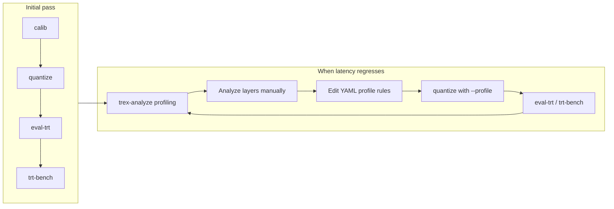

# PTQ performance troubleshooting workflow

Post-training quantization (PTQ) inserts **Q/DQ** nodes and can change how TensorRT fuses layers. That often helps latency, but it can also **hurt** it: extra **reformat** / cast-like operations, suboptimal kernels on sensitive ops, or overhead that outweighs int8/fp8 math savings. When that happens, treat tuning as an **iterative workflow** (measure → inspect → change quantization rules → rebuild → repeat).

This document describes a practical loop using **model-opt-yolo**: calibration, quantization, accuracy and speed checks, engine profiling, manual analysis, then **YAML quantization profiles** (`quantize --profile`) to steer which ops or nodes are quantized. The profile rules apply when you run **`quantize`**; they define **Model Optimizer** scope (include/exclude op types or node name patterns), not TensorRT “shape profiles” (batch × C × H × W), though you should keep build and calibration shapes consistent.

---

## Terms

| Term | Meaning here |
|------|----------------|
| **Quantization profile** | A **YAML** file passed to **`model-opt-yolo quantize --profile`**. It maps to Model Optimizer flags such as **`op_types_to_exclude`**, **`nodes_to_exclude`**, optional **`defaults.autotune`**, etc. Shipped examples live under [`model_opt_yolo/profiles/`](../model_opt_yolo/profiles/); copy and edit for your model. |
| **Profiling** | **`trtexec`** layer/timing exports, often via **`trex-analyze`**, to see which layers dominate latency (including reformat-like ops). |
| **Autotune** | (Optional) **`quantize --autotune`** — integrated Q/DQ tuning using TensorRT timing. You can **skip it** and tune **`--profile` YAML** only: quantize → build-trt → eval-trt → trt-bench → trex-analyze → edit profile → repeat. |

---

## Finding the best mode or method with pipeline-e2e

To **compare int8 / fp8 / int4** and calibration methods in one session (same `calib.npy`, same eval), use **`model-opt-yolo pipeline-e2e`**:

| Flag | Role |
|------|------|
| **`--quant-matrix all`** | Runs the full **six** combos: `int8.{entropy,max}`, `fp8.{entropy,max}`, `int4.{awq_clip,rtn_dq}`. Smaller specs: `int8.all`, `fp8.entropy`, comma-separated unions — see [Workflow](workflow.md#quant-matrix-spec). |
| **`--quantize-profile`** | Optional YAML **name or path** passed to **every** `quantize` as **`--profile`** (e.g. backbone whitelist **`yolo26n_no_nms_e2e_perf`**). |
| **`--high-precision-dtype`** | Optional override; **`quantize`** defaults to **fp16** (TensorRT-friendly). Use **fp32** here if you need to force FP32 high-precision strips. |
| **`--session-id`** | Recommended; outputs go to **`artifacts/pipeline_e2e/sessions/<id>/`** (quantized ONNX, engines, logs, **`report_<id>.md`**). |

Omit **`--autotune`** when you only want **profile + PTQ** tuning. **FP8** requires a GPU with **compute capability ≥ 8.9**.

**Report:** `pipeline-e2e` finishes with **`report-runs`** using **`--merge-global-logs`**, which can **mix** bench/eval logs from the global **`artifacts/`** tree with the session. For a table built **only** from that session, run:

```bash
model-opt-yolo report-runs --session-id <id> \
  -o artifacts/pipeline_e2e/sessions/<id>/report_session_only.md
```

(without passing **`--merge-global-logs`**).

The Markdown report lists **best** rows by **mAP**, **throughput (QPS)**, **mean GPU latency**, and a **combined** score (√(mAP×QPS/1000)); pick the metric that matches your product (accuracy vs latency).

**Agent Skills:** follow **[`skills/ptq-trt-performance/SKILL.md`](../skills/ptq-trt-performance/SKILL.md)** for the full agent checklist.

---

## Recommended loop (high level)



1. **Calib** — Build `calib.npy` consistent with your inference preprocessing (`calib`).
2. **Quantize** — First PTQ pass without a custom profile (or with a starter profile).
3. **Eval** — **`eval-trt`** on the engine built from the quantized ONNX; confirm accuracy is acceptable.
4. **Bench** — **`trt-bench`** on the same `.engine` for throughput/latency vs your FP16 baseline.
5. **Profiling** — **`trex-analyze`** on the quantized build, and **`trex-analyze --compare`** against the same ONNX built as **FP16** (`--mode fp16` on the primary ONNX vs `--compare-onnx` PTQ + `strongly-typed`) to see **per-layer** time deltas and spot **Reformat** / fusion breaks.
6. **Analyze (manual)** — Identify ops or regions to leave in higher precision or to exclude from quantization (node names in Netron often pair with TREx / trtexec layer names).
7. **Generate / edit profile** — YAML with **`include_nodes`** (whitelist) and/or **`exclude_op_types` / **`exclude_nodes`** (blacklist). No autotune required.
8. **Repeat with profile** — **`quantize ... --profile your_rules.yaml`** → **`build-trt`** → **`eval-trt`** → **`trt-bench`** → profiling again until latency and accuracy meet your targets. Use **`--suffix`** on **`quantize`** if you want several `.onnx` variants under the same folder without overwriting.

Steps 5–8 repeat until improvements flatten or you hit accuracy limits.

---

## Commands (sketch)

Use the same ONNX stem, shapes, and **`build-trt --mode`** you intend for production so comparisons are fair. If the original model uses an input name other than `images` (e.g. `input`), pass **`--input-name`** to **`build-trt`** and **`trex-analyze`**.

```bash
# 1) Calibration
model-opt-yolo calib --images_dir data/coco/val2017/ ... --output_path artifacts/calibration/calib_coco.npy

# 2) Quantize (first iteration — no custom profile)
model-opt-yolo quantize \
  --calibration_data artifacts/calibration/calib_coco.npy \
  --onnx_path models/yolo.onnx \
  --quantize_mode int8 --calibration_method entropy

# 2b) Quantize with a hand-tuned profile (no autotune) — try shipped YOLO26 examples under model_opt_yolo/profiles/
model-opt-yolo quantize \
  --calibration_data artifacts/calibration/calib_coco.npy \
  --onnx_path models/yolo.onnx \
  --quantize_mode int8 --calibration_method entropy \
  --profile yolo26n_no_nms_e2e_perf \
  --suffix .v1.quant.onnx

# 3–4) Build, evaluate, benchmark (paths follow your artifacts layout)
model-opt-yolo build-trt --onnx artifacts/quantized/<stem>.int8.entropy.quant.onnx --mode strongly-typed --img-size 640 --batch 1
model-opt-yolo eval-trt --engine artifacts/trt_engine/<stem>.b1_i640.engine ...
model-opt-yolo trt-bench --engine artifacts/trt_engine/<stem>.b1_i640.engine ...

# 5) Profile the quantized plan
model-opt-yolo trex-analyze \
  --onnx artifacts/quantized/<stem>.int8.entropy.quant.onnx \
  --mode strongly-typed --img-size 640

# 5b) Compare layer timings: FP16 TensorRT plan vs quantized ONNX (two builds — see --compare)
#     Primary = baseline ONNX + --mode fp16; second = PTQ ONNX + --strongly-typed.
model-opt-yolo trex-analyze \
  --onnx models/yolo.onnx \
  --mode fp16 \
  --compare \
  --compare-onnx artifacts/quantized/<stem>.int8.entropy.quant.onnx \
  --compare-onnx-mode strongly-typed \
  --img-size 640 --input-name <onnx_input_name>
# e.g. Ultralytics exports often use `images`; some checkpoints use `input`.
# Produces compare_layers__*.csv under artifacts/trex/runs/… or pipeline session trex/ — use it to spot
# layers where the int8 plan spends more time (often Reformat / cast-like ops when fusion breaks).
```

After you edit **`profiles/my_yolo_rules.yaml`** (starting from [`ultralytics_yolo26_flexible.yaml`](../model_opt_yolo/profiles/ultralytics_yolo26_flexible.yaml)):

```bash
model-opt-yolo quantize \
  --calibration_data artifacts/calibration/calib_coco.npy \
  --onnx_path models/yolo.onnx \
  --quantize_mode int8 --calibration_method entropy \
  --profile profiles/my_yolo_rules.yaml
```

Rebuild the engine and re-run **`eval-trt`**, **`trt-bench`**, and **`trex-analyze`** as needed.

### YOLO26n — profile candidates (no autotune, e2e export without embedded NMS)

The **`no_nms_e2e`** segment in the profile name denotes an **end-to-end** ONNX **without** embedded NMS (NMS runs in the app / eval). Shipped under [`model_opt_yolo/profiles/`](../model_opt_yolo/profiles/); pick one per run, compare **`trt-bench`** + **`eval-trt`** + optional **`trex-analyze --compare`** vs FP16.

| Profile | Idea |
|---------|------|
| **`yolo26n_no_nms_e2e_perf`** | Backbone-only Conv whitelist (`node_conv2d` … `_39`). |
| **`yolo26n_no_nms_e2e_perf_neck55`** | Same excludes, whitelist extended through **`node_conv2d_55`** (more neck in int8). |
| **`yolo26n_no_nms_e2e_perf_exclude_only`** | No whitelist; blacklist **Sigmoid / Softmax / Resize / Concat** + SiLU **`node_silu*`** — broader int8, validate mAP. |
| **`yolo26n_no_nms_e2e_perf_backbone_neck`** | Backbone + neck Convs through **`node_conv2d_75`** (indices **`_40`…`_75`** = neck in this export). Matches default **`fp16`** high-precision dtype. |
| **`yolo26n_no_nms_e2e_perf_backbone_head`** | Backbone + head Convs (**`_76`…`_101`**); neck Convs stay higher precision (two-regex **`include_nodes`**). |
| **`yolo26n_no_nms_e2e_perf_backbone_neck_head`** | All Convs (**stem + `_1`…`_101`**); widest int8 Conv coverage with the same SiLU / Sigmoid / Softmax excludes. |

Edit a copy of the YAML if **`trex-analyze`** shows expensive **Reformat** on specific **`node_conv2d_*`** names: add those to **`exclude_nodes`** (regex) or narrow **`include_nodes`**.

### Strongly-typed engine vs FP16 baseline — por que aparecem Reformat

- **`build-trt --mode strongly-typed`** (ONNX com Q/DQ): o TensorRT segue os tipos do grafo PTQ — regiões **int8** onde há quantização, e o restante na precisão **alta** que o **`quantize`** deixou (por defeito **`--high_precision_dtype fp16`**). Onde há **int8 ↔ FP16/FP32** incompatíveis entre fusões, o plano pode inserir **Reformat** / cópias.
- **`build-trt --mode fp16`** (ONNX **sem** Q/DQ): o builder promove **FP16** onde há suporte; o grafo fica mais **uniforme**, com menos troca de precisão do que um misto int8 + FP32.

A intuição **“backbone int8 + neck/head em precisão alta mais compatível com FP16”** reduz fronteiras com **`build-trt`**. Um **whitelist só no backbone** (como em **`yolo26n_no_nms_e2e_perf`**) já isola muito int8; se **`shape_inference`** falhar no **`quantize`**, use **`--high_precision_dtype fp32`** em vez de fp16.

---

## Optional: `quantize --autotune`

Integrated Q/DQ tuning (TensorRT timing) — **`quick`** / **`default`** / **`extensive`**. See [Workflow — autotune](workflow.md). Optional; profile-only tuning above is enough for many workflows.

---

## Related documentation

- [CLI reference — `quantize`](cli-reference.md#model-opt-yolo-quantize) (pass-through flags mirror Model Optimizer’s `--help`)
- [CLI reference — `pipeline-e2e`](cli-reference.md#model-opt-yolo-pipeline-e2e) — **`--quant-matrix`**, **`--quantize-profile`**, **`--high-precision-dtype`**
- [CLI reference — `trex-analyze`](cli-reference.md#model-opt-yolo-trex-analyze)
- [Workflow](workflow.md) — **`pipeline-e2e`**, **`--autotune`**, **`--quant-matrix`**
- [Troubleshooting](troubleshooting.md) — environment and parser issues
- Agent Skills: [`skills/ptq-trt-performance/SKILL.md`](../skills/ptq-trt-performance/SKILL.md) — agent checklist for benchmarking
- [YOLO26n end-to-end PTQ workflow](yolo26n-end-to-end-ptq-workflow.md) — export (Ultralytics / DeepStream-Yolo), COCO download, baseline vs profile, TREx, reference session charts
