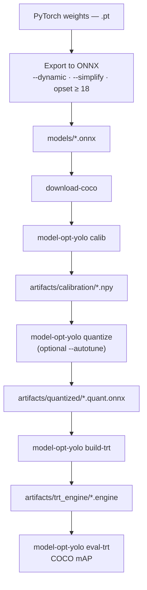

# Workflow

## Easiest path: `pipeline-e2e`

The simplest way to run everything is **`model-opt-yolo pipeline-e2e`**: it runs **calib** → **quantize** → **build-trt** → **eval-trt** → **trt-bench** and ends with **`report-runs`**, writing a **Markdown report** under `artifacts/pipeline_e2e/sessions/<session_id>/` (skip the report with `--no-report`). Pass **`--onnx`** and match **`--input-name`** / **`--output-format`** to your export; optional **`--autotune`**, **`--quant-matrix`**. See [CLI reference — pipeline-e2e](cli-reference.md#model-opt-yolo-pipeline-e2e).

---

## Overview (manual steps)

If you prefer to run each command yourself: **export ONNX** → **download-coco** (optional) → **calib** → **quantize** → **build-trt** → **eval-trt**. For aggregated latency/mAP summaries across runs, run **`report-runs`** on your log folders, or use **`pipeline-e2e`** above. Optional **`--autotune`** on `quantize` (details below).



| Step | Action |
|------|--------|
| 1 | Export detector to **ONNX** → `models/` |
| 2 | **Images + annotations** for calib and eval (`download-coco` or your layout) |
| 3 | **Calibration** — `model-opt-yolo calib` → `calib.npy` |
| 4 | **PTQ** — `model-opt-yolo quantize` with `--calibration_data` (optional `--autotune`) |
| 5 | **Engine** — `model-opt-yolo build-trt` (default `--mode strongly-typed` for PTQ ONNX; [CLI reference](cli-reference.md#model-opt-yolo-build-trt)) |
| 6 | **Eval** — `model-opt-yolo eval-trt --output-format …` ([CLI reference](cli-reference.md#model-opt-yolo-eval-trt)) |
| 7 | **Report** (optional if you did not use `pipeline-e2e`) — `report-runs` on your `trt-bench` / `eval-trt` log directories ([CLI reference](cli-reference.md#model-opt-yolo-report-runs)) |

---

## Autotune (`quantize --autotune`)

Autotune is a **flag on quantization**, not a separate step. It is implemented inside NVIDIA Model Optimizer’s `modelopt.onnx.quantization` and uses TensorRT timing to search Q/DQ placements that improve latency.

**Presets:** `quick`, `default`, `extensive` (trade speed vs search depth).

**Supported modes:** **`int8` and `fp8` only.** For **`int4`**, Model Optimizer does not run the autotuner; any `--autotune` argument is effectively ignored on that code path.

**Examples:**

```bash
model-opt-yolo quantize \
  --calibration_data artifacts/calibration/calib.npy \
  --onnx_path models/yolo.onnx \
  --autotune default
```

**End-to-end grid:** `pipeline-e2e --quant-matrix all` runs six mode/method pairs. If you add **`--autotune`**, it is passed to each `quantize` invocation; autotune runs only for the **int8** and **fp8** combos (four runs). The **int4** combos still run normal PTQ without autotune.

```bash
model-opt-yolo pipeline-e2e --onnx models/yolo.onnx --quant-matrix all --autotune default --continue-on-error
```

Passthrough flags for fine control (e.g. TRT shapes, timing) go after `--` to `modelopt.onnx.quantization`; see [CLI reference — quantize](cli-reference.md#model-opt-yolo-quantize).

---

## Preprocessing alignment

`calib` preprocessing must match the ONNX export: **input size**, **letterbox vs stretch**, **RGB vs BGR**, **normalization** (e.g. ÷255). Defaults match common Ultralytics-style exports (RGB, NCHW, letterbox).

---

## Further reading

- [CLI reference](cli-reference.md) — all subcommands and flags
- [Artifacts & logging](artifacts-and-logging.md) — paths and logs
- [Model Optimizer — ONNX PTQ](https://github.com/NVIDIA/Model-Optimizer/tree/main/examples/onnx_ptq) (upstream)
