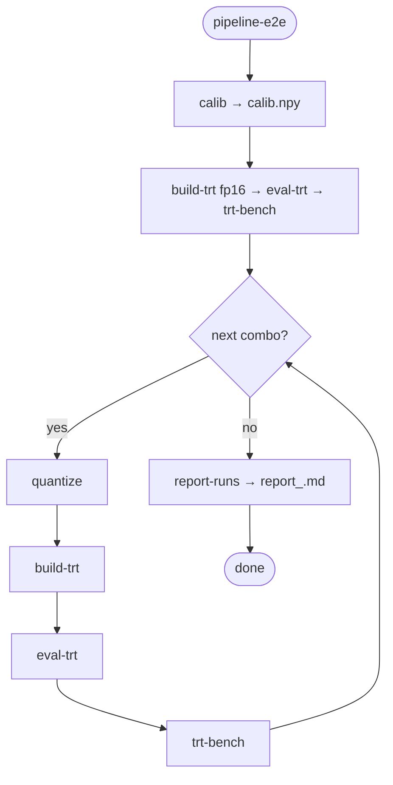
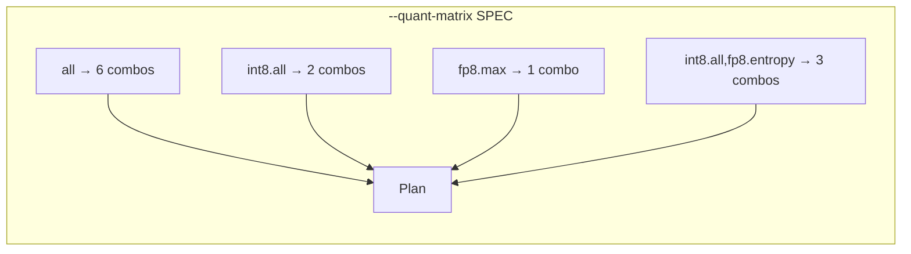
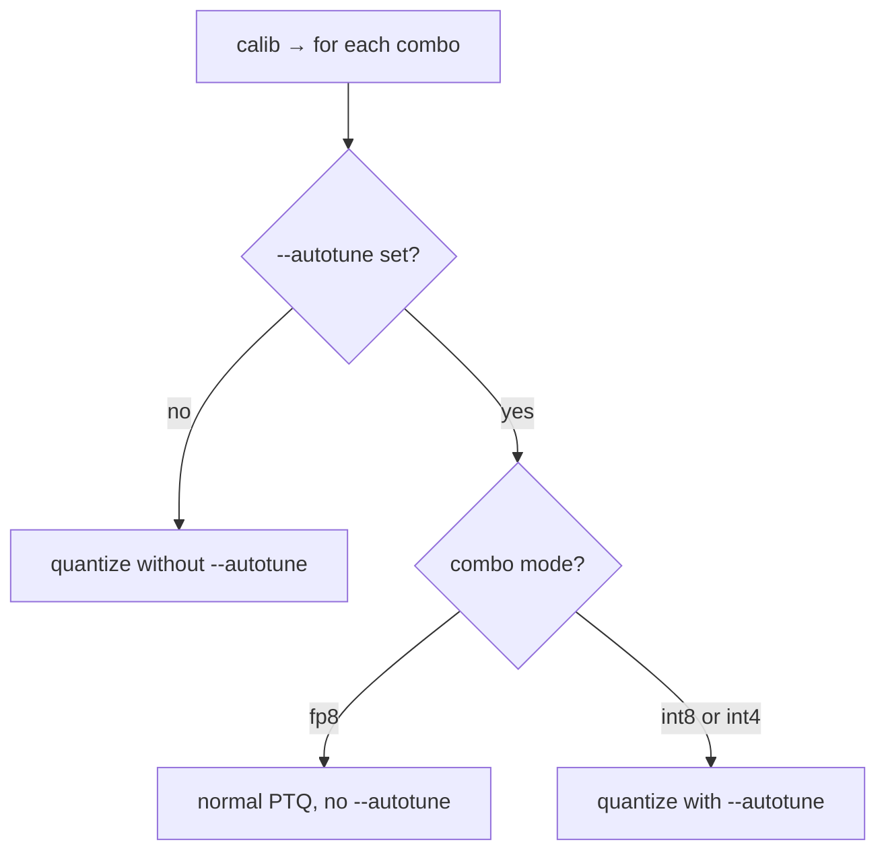
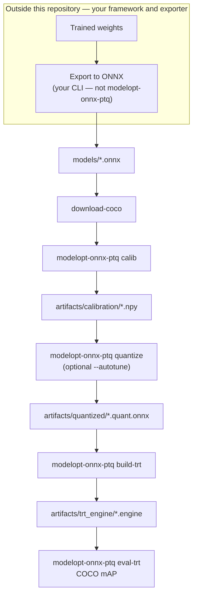

# Workflow

## Easiest path: `pipeline-e2e`

The simplest way to run everything is **`modelopt-onnx-ptq pipeline-e2e`**: it runs **calib** → **FP16 baseline** on the original ONNX (**`build-trt --mode fp16`** → **`eval-trt`** → **`trt-bench`**) → then **quantize** → **build-trt** → **eval-trt** → **trt-bench** for each quantization combo, and ends with **`report-runs`**, writing a **Markdown report** under `artifacts/pipeline_e2e/sessions/<session_id>/` (skip the report with `--no-report`). The FP16 step gives a **TensorRT FP16** reference row in the report (engine stem `<onnx-stem>.fp16`) so you can compare **FP16 vs int8/fp8/int4** in the same tables and charts. Use **`--no-fp16-baseline`** to skip that baseline. Pass **`--onnx`** and match **`--input-name`** / **`--output-format`** to your export. The default **`--output-format`** is **`auto`**, which forwards **`--onnx`** to each **eval-trt**. **`eval-trt`** only supports a **single** **`[B,N,6]`** detection tensor; four-tensor **`num_dets`** / **`det_*`** engines are not supported. Optional **`--autotune`**, **`--quant-matrix`**. See [CLI reference — pipeline-e2e](cli-reference.md#modelopt-onnx-ptq-pipeline-e2e).

### `pipeline-e2e` flow (graphical)

Every run performs **one** `calib`, then **one FP16 baseline** on the input ONNX, then **one pass per quantization combo** (each combo: `quantize` → `build-trt` → `eval-trt` → `trt-bench`), then **`report-runs`** unless `--no-report`.



### `--quant-matrix` (SPEC)

One string selects **which PTQ combos** run. There is **no** separate `--quantize-mode` / `--calibration-method` on `pipeline-e2e`; encode mode and method in SPEC.

| Form | Meaning |
|------|--------|
| **`all`** | Full grid (**6** runs): `int8.entropy`, `int8.max`, `fp8.entropy`, `fp8.max`, `int4.awq_clip`, `int4.rtn_dq`. |
| **`<mode>.all`** | Both calibration methods for that mode: `int8.all` → 2 runs; `fp8.all` → 2; `int4.all` → 2. |
| **`<mode>.<method>`** | Single run, e.g. `int8.entropy`, `fp8.max`, `int4.rtn_dq`. |
| **Comma-separated** | Union (order preserved, duplicates dropped), e.g. `int8.all,fp8.entropy` → 3 combos. |

Methods: **int8** / **fp8** → `entropy` \| `max`; **int4** → `awq_clip` \| `rtn_dq`.

Default if omitted: **`int8.entropy`** (one int8 run with entropy calibration).

To compare all six combos and optional **YAML profiles** in one session, see [PTQ performance workflow](quantization-performance-workflow.md#finding-the-best-mode-or-method-with-pipeline-e2e).

> **FP8 requires a capable GPU.** FP8 PTQ and inference need **NVIDIA GPUs with compute capability ≥ 8.9**, for example:
> - **Ada Lovelace** (RTX 4090, 4080, 4070, …) — CC 8.9  
> - **Hopper** (H100, H200) — CC 9.0  
> - **Blackwell** (B200, RTX 5090, 5080, …) — CC 10.0+  



### When `quantize` gets `--autotune`

For **every** plan, **fp8** subprocesses **never** receive `--autotune` (Model Optimizer limitation on typical detectors). **int8** subprocesses receive `--autotune` when you pass **`--autotune`**. **int4** may receive the flag, but **Model Optimizer ignores integrated autotune for int4** upstream.

| `--autotune` | int8 combo | fp8 combo | int4 combo |
|--------------|------------|-----------|------------|
| omitted | no `--autotune` | no `--autotune` | no `--autotune` |
| set | passes `--autotune` | **no** `--autotune` (normal PTQ) | passes `--autotune`* |

\*Ignored by Model Optimizer for int4.



---

## Overview (manual steps)

If you prefer to run each command yourself: **export ONNX** (in your original framework — not this repo) → **download-coco** (optional) → **calib** → **quantize** → **build-trt** → **eval-trt** (and **`trt-bench`** for throughput). Optional **`--autotune`** on `quantize` (details below).

**Manual comparison (FP16 vs quantized):** To mirror `pipeline-e2e`, build an FP16 TensorRT engine from the **original** FP32 ONNX with **`modelopt-onnx-ptq build-trt --onnx models/your.onnx --mode fp16`** (default output **`artifacts/trt_engine/<stem>.fp16.b<batch>_i.engine`**, or set **`--engine-out`** yourself). The FP16 baseline **stem** for logs is still **`<onnx-stem>.fp16`**. Then run **`eval-trt`** and **`trt-bench`** on that engine. Run the same for each quantized ONNX. Aggregate results with **`report-runs`** (see below).

**Same `session_id` for manual runs:** Pick an id (e.g. `myrun-20260411`) and pass **`--session-id <id>`** to **`build-trt`**, **`eval-trt`**, and **`trt-bench`** (when you omit **`--log-file`**, logs go under `artifacts/pipeline_e2e/sessions/<id>/…`). Or set **`export SESSION_ID=myrun-20260411`** once in the shell: every command uses it automatically until you override with **`--session-id`**. Then run **`modelopt-onnx-ptq report-runs`** (or **`report-runs --session-id …`**) to generate **`report_<id>.md`** in that session folder.



| Step | Action |
|------|--------|
| 1 | **Export** detector to **ONNX** in your training stack → place under `models/` (export commands are **not** provided here) |
| 2 | **Images + annotations** for calib and eval (`download-coco` or your layout) |
| 3 | **Calibration** — `modelopt-onnx-ptq calib` → `calib.npy` |
| 4 | **PTQ** — `modelopt-onnx-ptq quantize` with `--calibration_data` (optional `--autotune`) |
| 5 | **Engine** — `modelopt-onnx-ptq build-trt` (default `--mode strongly-typed` for PTQ ONNX; [CLI reference](cli-reference.md#modelopt-onnx-ptq-build-trt)) |
| 6 | **Eval** — `modelopt-onnx-ptq eval-trt --output-format auto --onnx …` or explicit format ([CLI reference](cli-reference.md#modelopt-onnx-ptq-eval-trt)) |
| 7 | **Bench** (optional but needed for QPS in the report) — `modelopt-onnx-ptq trt-bench --engine …` |
| 8 | **Report** — `report-runs` on your `trt-bench` / `eval-trt` log directories, or **`report-runs --session-id <id>`** if you used `--session-id` on the steps above ([CLI reference](cli-reference.md#modelopt-onnx-ptq-report-runs)) |

---

## Autotune (`quantize --autotune`)

Autotune is a **flag on quantization**, not a separate step. It is implemented inside NVIDIA Model Optimizer’s `modelopt.onnx.quantization` and uses TensorRT timing to search Q/DQ placements that improve latency.

**Presets:** `quick`, `default`, `extensive` (trade speed vs search depth).

**Supported modes:** **`int8` and `fp8` only.** For **`int4`**, Model Optimizer does not run the autotuner; any `--autotune` argument is effectively ignored on that code path.

**FP8 + `--autotune`** on many detector ONNX graphs fails in Model Optimizer. In **`pipeline-e2e`**, any **fp8** combo runs **without** `--autotune`; **int8** combos still get **`--autotune`** when you pass it.

**Examples:**

```bash
modelopt-onnx-ptq quantize \
  --calibration_data artifacts/calibration/calib.npy \
  --onnx_path models/yolo.onnx \
  --autotune default
```

**End-to-end:** `pipeline-e2e --quant-matrix all` runs the full six mode/method pairs. With **`--autotune`**, int8 (and int4 flag passthrough) use autotune; fp8 steps use standard PTQ. The pipeline logs a notice when the plan includes fp8 and `--autotune` is set.

```bash
modelopt-onnx-ptq pipeline-e2e --onnx models/yolo.onnx --quant-matrix all --autotune default --continue-on-error
```

Passthrough flags for fine control (e.g. TRT shapes, timing) go after `--` to `modelopt.onnx.quantization`; see [CLI reference — quantize](cli-reference.md#modelopt-onnx-ptq-quantize).

---

## Preprocessing alignment

`calib` preprocessing must match the ONNX export: **input size**, **letterbox vs stretch**, **RGB vs BGR**, **normalization** (e.g. ÷255). Defaults match common Ultralytics-style exports (RGB, NCHW, letterbox).

---

## Further reading

- [CLI reference](cli-reference.md) — all subcommands and flags
- [Artifacts & logging](artifacts-and-logging.md) — paths and logs
- [Model Optimizer — ONNX PTQ](https://github.com/NVIDIA/Model-Optimizer/tree/main/examples/onnx_ptq) (upstream)
