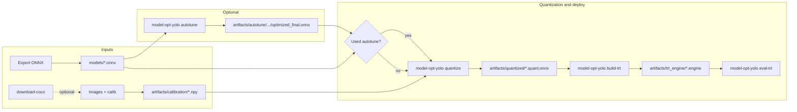

# Workflow

## Overview

| Step | Action |
|------|--------|
| 1 | Export your detector to **ONNX** → place under `models/` |
| 2 | *(Optional)* **COCO val** — images + annotations for calib/eval (`model-opt-yolo download-coco`) |
| 3 | *(Optional)* **Autotune** — Q/DQ placement for TensorRT (`model-opt-yolo autotune`) |
| 4 | **Calibration** — build `calib.npy` from images (`model-opt-yolo calib`) |
| 5 | **PTQ** — quantize using calibration data (`model-opt-yolo quantize`) |
| 6 | **Engine** — `model-opt-yolo build-trt --onnx …` |
| 7 | **Eval** — COCO mAP (`model-opt-yolo eval-trt --output-format …`) — set **`--output-format`**: **`onnx_trt`** (four tensors; [levipereira/ultralytics](https://github.com/levipereira/ultralytics) `onnx_trt`), **`ultralytics`**, or **`deepstream_yolo`** (`efficient_nms` is an alias for `onnx_trt`) — see [CLI reference](cli-reference.md#model-opt-yolo-eval-trt) |

---

## Autotune vs PTQ

- **Autotune** searches **where** to insert Q/DQ nodes using **TensorRT** timing. It does **not** replace full calibration.
- **Quantize** runs Model Optimizer **PTQ** with your `calib.npy` and produces the quantized ONNX.

Typical order: **download-coco (optional)** → **autotune (optional)** → **calib** → **quantize** (using `optimized_final.onnx` if you autotuned) → **engine** → **eval**.

---

## Preprocessing alignment

Calibration preprocessing (`calib`) must match how the ONNX was exported: **input size**, **letterbox vs resize**, **RGB vs BGR**, **normalization** (e.g. ÷255). Defaults follow common Ultralytics-style exports (RGB, NCHW, letterbox).

---

## Further reading

- [Model Optimizer ONNX PTQ example](https://github.com/NVIDIA/Model-Optimizer/tree/main/examples/onnx_ptq)
- [Artifacts & logging](artifacts-and-logging.md) for output paths and log files
