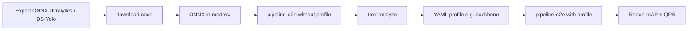
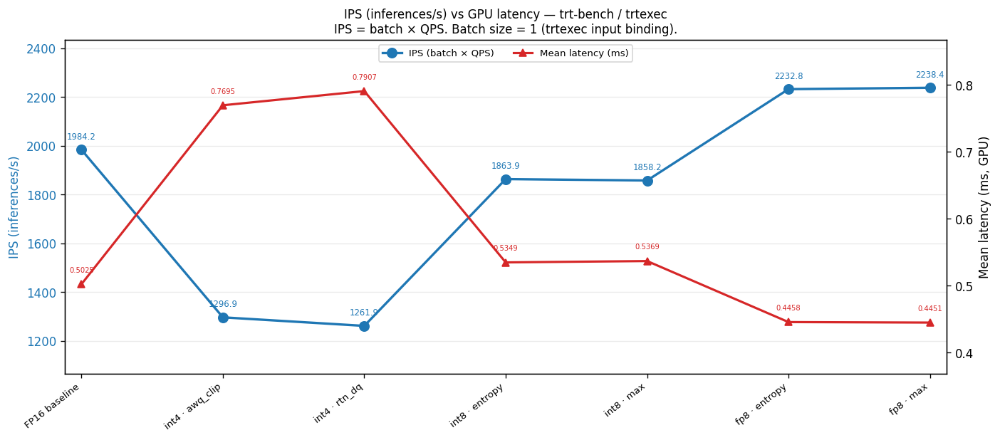
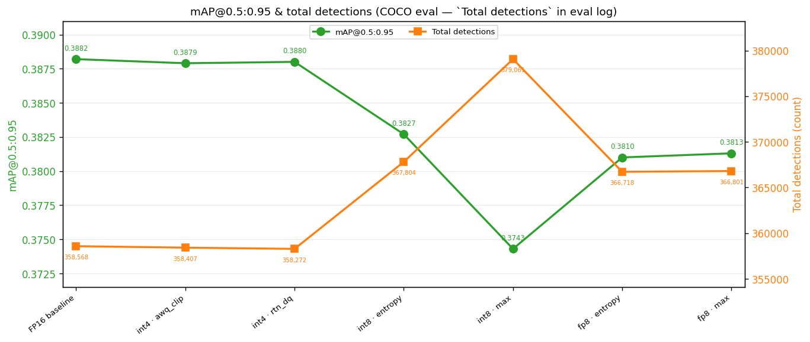

# YOLO26n — end-to-end PTQ workflow (reference)

This document describes a **recommended workflow** for **NVIDIA Model Optimizer** with **modelopt-onnx-ptq**: run a full quantization grid, inspect the TensorRT plan, define a **YAML profile** (partial quantization), then re-run the same grid (`--quant-matrix all`) to compare **mAP** and **latency**.

The example ONNX is **`models/yolo26n_no_nms_e2e.onnx`** — an end-to-end detector **without embedded NMS** (NMS handled outside the graph).

---

## Prerequisites — export, dataset, and `models/`

### 1. Export ONNX from the upstream stack

Before calibration and quantization, you need an ONNX file that matches how you will deploy and evaluate:

- **Ultralytics YOLO (recommended source)** — Export from the **official Ultralytics** package / CLI so tensor names, strides, and preprocessing stay consistent with Ultralytics tooling. See the Ultralytics export documentation: [Ultralytics — Export](https://docs.ultralytics.com/modes/export/).
- **DeepStream-Yolo alignment** — If you target [DeepStream-Yolo](https://github.com/marcoslucianops/DeepStream-Yolo), use its YOLO26 primary config as a reference for ONNX naming, batching, and inference settings (for example [`config_infer_primary_yolo26.txt`](https://github.com/marcoslucianops/DeepStream-Yolo/blob/master/config_infer_primary_yolo26.txt)): `onnx-file`, `net-scale-factor`, `model-color-format`, `num-detected-classes`, and custom parse settings. Export or adapt your ONNX so it matches the same input layout and output tensor layout you will use in DeepStream and in **modelopt-onnx-ptq** (e.g. `--output-format deepstream_yolo` for a pre-NMS `[B, N, 6]` tensor).

Match **input name**, **image size**, and **NMS placement** (in-graph vs post-processing) to what you pass into **`pipeline-e2e`** (`--input-name`, `--output-format`, etc.).

### 2. Download the COCO validation set

Calibration and COCO eval expect images and annotations under the usual tree (see [Workflow](workflow.md)):

```bash
modelopt-onnx-ptq download-coco --output-dir data/coco
```

### 3. Place the ONNX under `models/`

Copy or symlink your exported ONNX into the repo’s **`models/`** directory (for example `models/yolo26n_no_nms_e2e.onnx`). **Do not commit** large weights; keep them local or mount `models/` in Docker.

After that, follow the phased pipeline below.

---

## Why neck and head need extra care

1. **Latency and fusion** — If the TensorRT plan adds **Reformat** layers or fails to fuse nodes (e.g. mixed scales/precision around neck/head), latency can **increase** vs expectation — not every int8 build saves milliseconds.
2. **Accuracy** — **Neck** and **head** are often **more sensitive** to aggressive PTQ (**broad int8**). Quantizing **only the backbone** (whitelist) is a common pattern to **preserve mAP** while still exploring speedups.

Everything remains **configurable**: profile `include_nodes` / `exclude_*`, `--high-precision-dtype`, and int8/fp8/int4 modes in `quantize`.

---

## Phased flow



### Phase 1 — Full grid **without** `--quantize-profile`

Run **`pipeline-e2e`** with **`--quant-matrix all`** (six combinations: int8/fp8/int4 × calibration methods) **without** `--quantize-profile`. Example:

```bash
modelopt-onnx-ptq pipeline-e2e \
  --onnx models/yolo26n_no_nms_e2e.onnx \
  --calibration-data-size 1000 \
  --input-name input \
  --output-format deepstream_yolo \
  --high-precision-dtype fp16 \
  --quant-matrix all \
  --session-id yolo26n_quant_baseline
```

You get:

- Quantized ONNX per combination  
- TensorRT engines  
- **`eval-trt`** (mAP) and **`trt-bench`** (QPS / latency)  
- Session output under `artifacts/pipeline_e2e/sessions/<session_id>/`

Use this as a **baseline** to see which mode/method behaves best **before** restricting nodes.

### Phase 2 — Profiling and analysis (`trex-analyze`)

Run **`modelopt-onnx-ptq trex-analyze`** on the quantized ONNX files (and optionally **`--compare`** vs FP16) to inspect **slow layers**, **Reformat**, broken fusions, etc.

**How to interpret results**

- **Agent Skill** — Follow **[`skills/ptq-trt-performance/SKILL.md`](../skills/ptq-trt-performance/SKILL.md)** for the benchmarking checklist and report reading.
- **Manual** — TREx CSV/HTML, or **Jupyter** in the environment where **TREx** is installed (e.g. Docker with `/workspace/TREx`), to drill into **per profile / per build**. You can also use an LLM or agent workflow on exported latency tables, consistent with your review policy.

### Phase 3 — Author a YAML profile (partial quantization)

Define rules in YAML (e.g. **backbone only** with `include_nodes`). Packaged example:

- [`modelopt_onnx_ptq/profiles/yolo26n_no_nms_e2e_backbone.yaml`](../modelopt_onnx_ptq/profiles/yolo26n_no_nms_e2e_backbone.yaml) — Conv whitelist for the backbone (`node_conv2d` … `_39`); neck/head stay at higher precision (with `--high-precision-dtype fp16` in `quantize`, matching the current CLI default).

Copy and adapt for **your** ONNX if node names differ.

### Phase 4 — Full grid **with** `--quantize-profile`

Run **`pipeline-e2e`** again with the **same** `--quant-matrix all` and **`--quantize-profile <name>`** so **every** `quantize` step applies the same rules. Compare mAP and throughput **with profile** vs Phase 1 (no profile).

---

## Example command — grid **with** backbone profile (reference session)

This command produced session **`yolo26n_prof_backbone`** (report and charts below), **after** defining the profile [`yolo26n_no_nms_e2e_backbone.yaml`](../modelopt_onnx_ptq/profiles/yolo26n_no_nms_e2e_backbone.yaml):

```bash
modelopt-onnx-ptq pipeline-e2e \
  --onnx models/yolo26n_no_nms_e2e.onnx \
  --calibration-data-size 1000 \
  --input-name input \
  --output-format deepstream_yolo \
  --quantize-profile yolo26n_no_nms_e2e_backbone \
  --high-precision-dtype fp16 \
  --quant-matrix all \
  --session-id yolo26n_prof_backbone
```

- **`--output-format deepstream_yolo`** — Matches a pre-NMS `[B, N, 6]` tensor; use **`ultralytics`** or **`onnx_trt`** if your export differs.
- **`--high-precision-dtype fp16`** — Also the current **`quantize`** default; you may omit it if you rely on defaults.
- The session writes **`e2e_report.md`** by default; a manually named report **`report_yolo26n_prof_backbone.md`** may also exist in the same folder.

---

## Reference results (session `yolo26n_prof_backbone`)

Charts copied under `docs/images/` from the reference run (RTX 4090):

### Throughput and latency (`trt-bench`)



### mAP and detections (COCO eval)



**Full Markdown report** (tables, FP16 comparison, versions):  
`artifacts/pipeline_e2e/sessions/yolo26n_prof_backbone/report_yolo26n_prof_backbone.md`

Summary numbers from that report:

| Note | Content |
|------|---------|
| FP16 baseline | mAP@0.5:0.95 ≈ **0.388**, QPS ≈ **1984** |
| Best mAP (quantized) | int4 **rtn_dq** ≈ **0.388** mAP |
| Best throughput | **fp8 max** ≈ **2238** QPS, mean GPU latency ≈ **0.45** ms |

*(Exact values are in the session report tables.)*

---

## Related documentation

- [Workflow](workflow.md) — `pipeline-e2e`, `--quant-matrix`
- [PTQ performance workflow](quantization-performance-workflow.md) — profiles, `trex-analyze`, hpfp16
- [CLI reference — pipeline-e2e](cli-reference.md#modelopt-onnx-ptq-pipeline-e2e)
- [CLI reference — trex-analyze](cli-reference.md#modelopt-onnx-ptq-trex-analyze)
- Benchmark skill: [`skills/ptq-trt-performance/SKILL.md`](../skills/ptq-trt-performance/SKILL.md)

---

## Flexibility

You can:

- toggle **with / without** `--quantize-profile` on the same grid;
- tune **whitelist/blacklist** by node name;
- pick **int8 / fp8 / int4** and calibrators from `report-runs` output;
- keep **neck/head in higher precision** and int8 on the backbone, or grow the whitelist gradually **if** mAP and latency allow.

This gives a **concrete example** of **Model Optimizer + TensorRT + COCO eval** end to end with **modelopt-onnx-ptq**.
